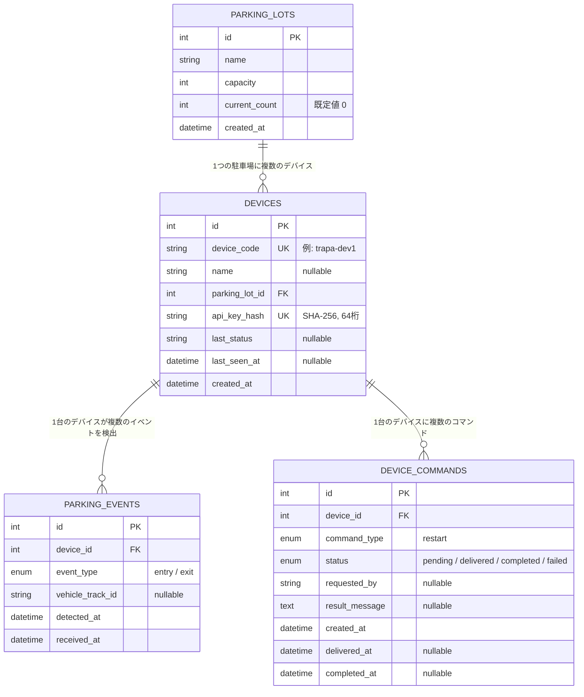

# DB構成

MySQL 9.2。スキーマは Alembic マイグレーション（`migrations/versions/`）で管理しており、
このドキュメントは `app/models/` の SQLAlchemy モデルと同期させる。モデルを変更したら
このファイルとマイグレーションも合わせて更新すること。

## ER図



## テーブル定義

### `parking_lots` — 駐車場

| カラム | 型 | 制約 | 説明 |
|---|---|---|---|
| `id` | INT | PK, AUTO_INCREMENT | |
| `name` | VARCHAR(255) | NOT NULL | 駐車場名 |
| `capacity` | INT | NOT NULL | 収容台数 |
| `current_count` | INT | NOT NULL, 既定値0 | 現在の駐車台数。`parking_events` 登録時に増減し、非負に固定される |
| `created_at` | DATETIME | NOT NULL | 登録日時 |

駐車場の削除は、紐づく `devices` が1件でも存在すると409エラーになる（先にデバイスを削除・
他の駐車場へ移動すること）。

### `devices` — エッジデバイス

| カラム | 型 | 制約 | 説明 |
|---|---|---|---|
| `id` | INT | PK, AUTO_INCREMENT | |
| `device_code` | VARCHAR(64) | UNIQUE, NOT NULL | 人間可読な識別コード（例: `trapa-dev1`） |
| `name` | VARCHAR(255) | NULL可 | 表示名 |
| `parking_lot_id` | INT | FK → `parking_lots.id`, NOT NULL | 設置先の駐車場 |
| `api_key_hash` | VARCHAR(64) | UNIQUE, NOT NULL | APIキーのSHA-256ハッシュ（16進64桁）。平文キーは登録時のレスポンスにのみ含まれ、DBには保存しない |
| `last_status` | VARCHAR(32) | NULL可 | 直近のハートビートで自己申告された状態（例: `ok`） |
| `last_seen_at` | DATETIME | NULL可 | 最終通信日時。`devices` 一覧APIの `online` 判定に使用（`DEVICE_OFFLINE_THRESHOLD_SECONDS` 以内なら online） |
| `created_at` | DATETIME | NOT NULL | 登録日時 |

デバイス認証は `X-API-Key` ヘッダーの値をSHA-256でハッシュ化し、`api_key_hash` と一致するレコードを
検索して行う（`app/deps.py`）。ランダムな高エントロピートークンのハッシュ照合のため、bcryptのような
ソルト付きKDFは使っていない。

デバイスの削除は、紐づく `parking_events` / `device_commands` を ON DELETE CASCADE で
まとめて削除する（履歴も含めて完全に削除される。駐車場の集計 `current_count` はイベント登録時に
更新済みの値がそのまま残り、削除時に再計算はしない）。

### `parking_events` — 入出庫イベント

| カラム | 型 | 制約 | 説明 |
|---|---|---|---|
| `id` | INT | PK, AUTO_INCREMENT | |
| `device_id` | INT | FK → `devices.id` ON DELETE CASCADE, NOT NULL, INDEX | イベントを検出したデバイス |
| `event_type` | ENUM('entry','exit') | NOT NULL | `entry`=入庫, `exit`=出庫 |
| `vehicle_track_id` | VARCHAR(64) | NULL可 | エッジ側トラッカーの追跡ID（同一車両の入出庫を紐づける参考情報） |
| `detected_at` | DATETIME | NOT NULL | エッジデバイスが検出した日時 |
| `received_at` | DATETIME | NOT NULL | サーバーが受信した日時 |

`POST /api/v1/events` でイベントを作成する際、同一トランザクション内で対象駐車場の行を
`SELECT ... FOR UPDATE` でロックし、`current_count` を更新する（`entry`で+1、`exit`で-1、
0未満にはならない）。

### `device_commands` — デバイスへのコマンドキュー

| カラム | 型 | 制約 | 説明 |
|---|---|---|---|
| `id` | INT | PK, AUTO_INCREMENT | |
| `device_id` | INT | FK → `devices.id` ON DELETE CASCADE, NOT NULL, INDEX | コマンドの宛先デバイス |
| `command_type` | ENUM('restart') | NOT NULL | コマンド種別。現状は再起動のみ |
| `status` | ENUM('pending','delivered','completed','failed') | NOT NULL, 既定値`pending` | 状態遷移は下記参照 |
| `requested_by` | VARCHAR(255) | NULL可 | 発行者（Webダッシュボードなど） |
| `result_message` | TEXT | NULL可 | デバイスからの実行結果メッセージ |
| `created_at` | DATETIME | NOT NULL | キュー登録日時 |
| `delivered_at` | DATETIME | NULL可 | デバイスがハートビートで受け取った日時 |
| `completed_at` | DATETIME | NULL可 | デバイスが結果を報告した日時 |

状態遷移（サーバーからデバイスへの直接プッシュはなく、すべてデバイス発のポーリングで進む）:

```
pending --(デバイスが /heartbeat を呼ぶ)--> delivered --(デバイスが /commands/{id}/ack を呼ぶ)--> completed | failed
```

## 共通事項

- **タイムスタンプ**: すべて `DATETIME`（タイムゾーン情報なし）で、値はローカル時刻（Asia/Tokyo）の
  naive datetime として統一している。現場のエッジデバイス群（device）がシステムクロックを
  ローカル時刻で運用している慣習に合わせたもので、UTCへの変換は行わない（`app/utils.py` の
  `now_local()` / `to_naive_local()`）。
- **マイグレーション追加手順**（`services/api` 直下で実行）:
  ```bash
  .venv/bin/alembic revision --autogenerate -m "add xxx"
  .venv/bin/alembic upgrade head
  ```
